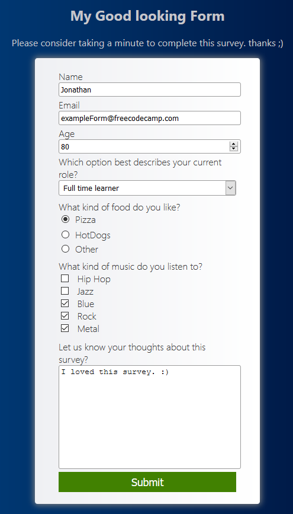

##  My Survey Form for FreeCodeCamp.
This repository contains the code for Responsive Web Design Projects - Build a Survey Form

### About the code

I created using only pure HTML and CSS a survey form for FreeCodeCamp, 
Following the instructions of the challenge I had to use inside a `<form>` with the `id="survey-form"` and inside a 
`id="title"`
`id="description"`
`id="name"`
`id="email"`
`id="number"`
`id="name-tag"`
`id="email-label"`
`id="number-label"`
`id="dropdown"`

also uses the `min` and `max` attributes to create the input range of the numbers. If I enter numbers outside the input range of the numbers you will see a HTML5 validation error
finally a button with `id="submit"` to send all my contributions.
    
### ScreenShots  
## Survey Form

## Survey Form

### You can see it better in my codepen:
<a href="https://codepen.io/Jonth8295/pen/BaovgLM" target="_blank">Survey Form for FreeCodeCamp Responsive Web Design Projects</a>
